# rhogov user guide

rhogov helps a group of people decide things together on RChain. You can vote,
hand your vote to someone you trust, vouch for each other, hold each other to
account, send each other messages, and run decisions across several kinds of
stakeholders. Everything is recorded on the blockchain, and no administrator
sits in the middle.

This guide walks through rhogov the way you'll meet it. You don't need to know
anything about blockchains to follow it.

**Contents**

1. [Getting started](#1-getting-started)
2. [Communities and invitations](#2-communities-and-invitations)
3. [Groups](#3-groups)
4. [Voting](#4-voting)
5. [Delegating your vote](#5-delegating-your-vote)
6. [Trust](#6-trust)
7. [Censure](#7-censure)
8. [Inbox](#8-inbox)
9. [Councils: decisions across stakeholder groups](#9-councils-decisions-across-stakeholder-groups)
10. [Your account and your key](#10-your-account-and-your-key)
11. [What is public, and what it costs](#11-what-is-public-and-what-it-costs)
12. [Troubleshooting](#12-troubleshooting)
13. [Glossary](#13-glossary)

---

## 1. Getting started

Open rhogov. The first screen walks you through three short steps.

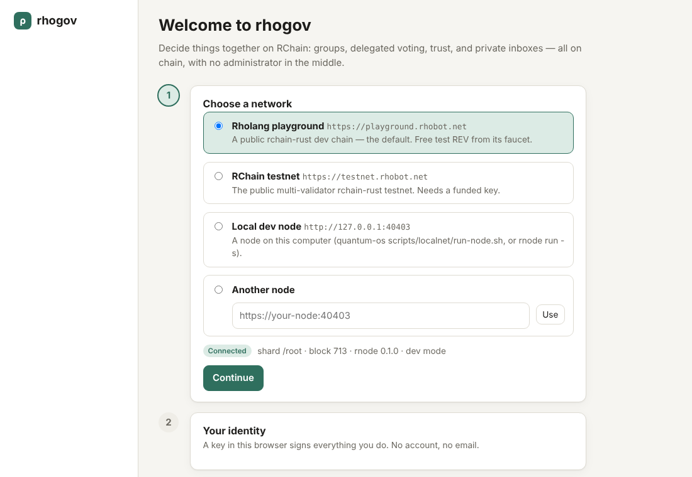

**Step 1: choose a network.** A network is the blockchain your community uses.
The **Rholang playground** is selected for you. It's free, it hands out test
money, and it's the right place to start. Pick the **RChain testnet** or another
node only if your community told you to.

**Step 2: your identity.** Type the name you'd like others to see, then press
**Continue**. rhogov creates a *key* for you in your browser. The key is your
identity: it signs everything you do, and it never leaves your device. There's
no account, no email and no password. (Already have an RChain key? Choose **I
have a key** and paste it.)

Once your key exists you'll see your balance. On the playground, press **Get test
REV**. A moment later you'll have enough to act. Every action costs a tiny fee,
paid in REV (see [section 11](#11-what-is-public-and-what-it-costs)).

**Step 3: join or start a community.** If someone sent you an invite link,
paste it and press **Join community**. Otherwise choose **Start a new community**
(next section).

> **Back up your key** (Account → Download backup) once you've set up. If you
> clear your browser's data without a backup, that identity is gone.

## 2. Communities and invitations

A **community** is everyone who uses the same set of governance contracts on the
same network. A community can hold any number of groups and councils.

**Starting one.** Give it a name and press **Start community**. rhogov installs
three small contracts with your key (Inbox, Group and Issue), which takes a few
seconds. Installing them gives you no special power: you're an ordinary member
like everyone else.

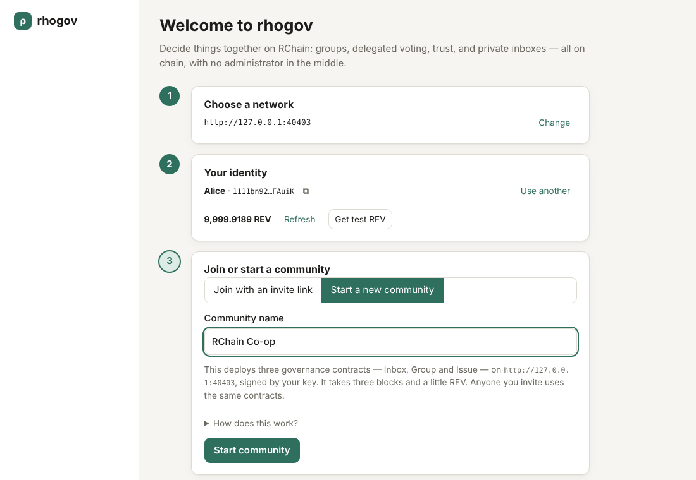

**Inviting people.** Go to **Community** and copy the invite link. Send it any
way you like. It holds only the network address and the contract addresses,
nothing secret. Whoever opens it is guided through creating their own key.

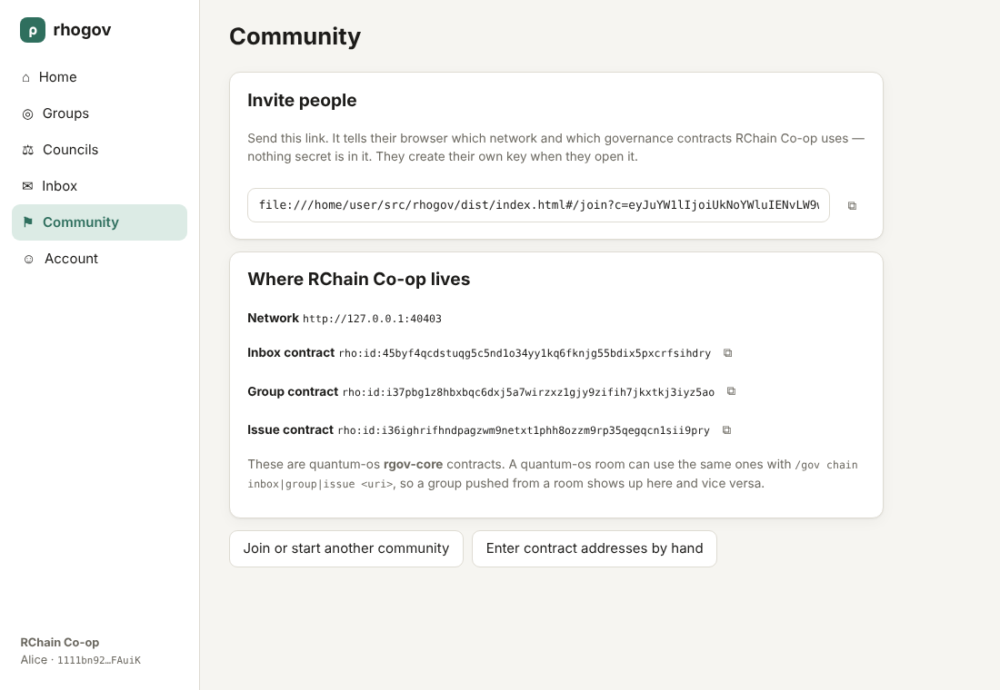

You can belong to several communities; switch between them on the **Community**
page.

## 3. Groups

A **group** is a set of people who vote together. Open **Groups** to see the
groups you're in and the others in the community.

**Create a group** with **＋ New group** and choose who can join:

- **Open**: anyone in the community can join.
- **Invite only**: an admin invites people by their address, and they join when
  they're ready.

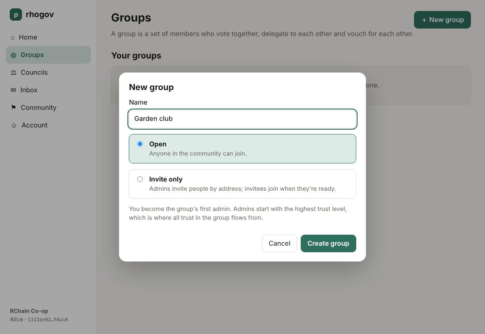

Whoever creates a group is its first **admin**. Admins can invite people (with
an optional message to their inbox) and make other members admins. Admins have
no extra say in votes, apart from the trust they start with
([section 6](#6-trust)).

A group's page has three tabs: **Votes**, **Members**, and **About** (its
settings, and **Leave group**).

## 4. Voting

Open a group and press **＋ New vote**. Write the question, add at least two
options, and choose how people vote:

- **Approval**: tick every option you're happy with. The option with the most
  support wins.
- **Ranked choice**: put options in order of preference. If no option has a
  majority, the last-placed option is removed and its votes move to each voter's
  next choice, until one wins (an *instant runoff*).

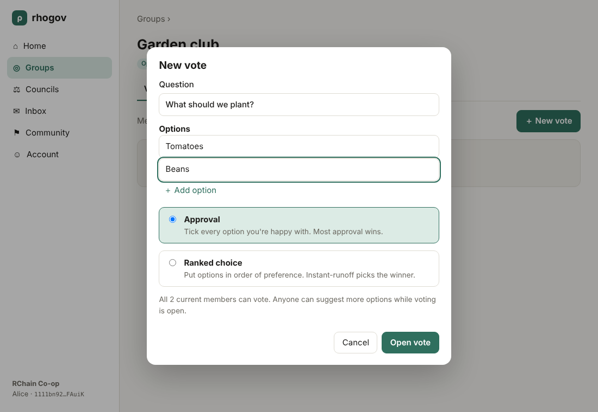

Everyone who was a member when the vote opened can vote. You can change your
vote any time until voting closes. Anyone can **suggest another option** while
it's open.

**Results.** The **Standing so far** panel shows each option's support and the
current leader. The node itself does the counting: nobody (not the person who
opened the vote, not this app) tallies votes by hand. Open **Who voted, and with
what weight** to see each ballot and how much it counts for.

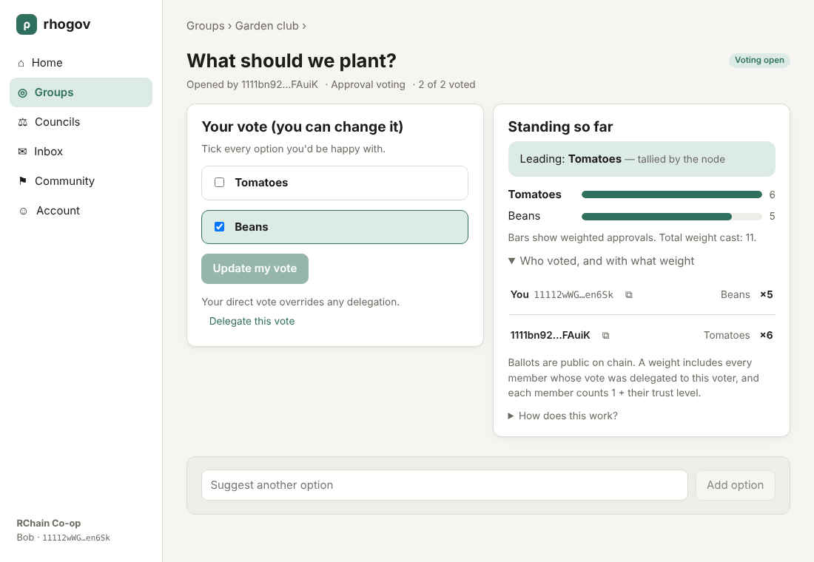

**Closing.** Whoever opened the vote can **Close voting and record result**. The
result is saved on chain under their name, with a badge showing whether it
**matches the node's tally**. If it doesn't, everyone can see that.

**Joined late?** If you joined a group after a vote opened, you're not on that
vote's list of voters yet. The person who opened it sees an **Add N new members
to the roll** button.

## 5. Delegating your vote

Can't follow every decision? **Delegate** your vote to someone you trust:

- On a group's **Members** tab, press **Delegate my vote** to choose a delegate
  for *every* vote in that group.
- On a single vote, press **Delegate this vote** to choose someone for *just that
  vote*. It overrides your usual delegate there.

How it works:

- If you don't vote, your vote goes to your delegate.
- If your delegate doesn't vote either, it passes on to *their* delegate, and so
  on.
- **Voting yourself always wins.** Your own ballot replaces your delegation for
  that vote.
- A delegation that loops back on itself is ignored, and those votes aren't
  counted.

You can **take it back** at any time.

## 6. Trust

Votes can be weighted by **trust**, so people the group trusts more count for a
little more. Trust starts at zero for everyone, which means **one person, one
vote**, until someone rates someone.

- Admins start at the top level, **5**.
- On the **Members** tab, press **Rate** next to someone and pick a level from
  0 to 5.
- **You can give at most one level below your own.** Two newcomers can't vouch
  each other up; trust flows down from the admins.
- Each vote counts for **1 + the voter's trust level**.

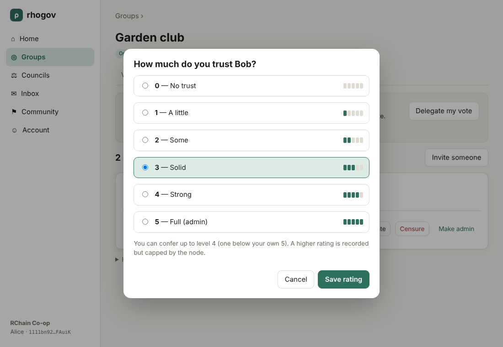

The Members tab shows each person's level as small bars, who they vote through,
and how many votes they carry for others.

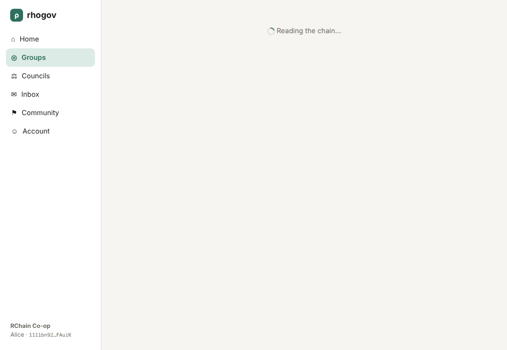

## 7. Censure

Trust can be withdrawn. If you think someone's trust is undeserved, press
**Censure** next to them.

- Only censures from members **at or above that person's trust level** count.
  Lower-trust members can't gang up on higher-trust ones.
- When **two-thirds** of those members (and at least two people) censure someone,
  their trust drops to **0**.
- Everyone who vouched for them **loses the trust they staked** on them. Vouch
  carefully.

You can **Withdraw censure** at any time, and the effect lifts if support falls
below two-thirds.

## 8. Inbox

Anyone in the community can send you a message, and you can message anyone.
Press **✎ New message**, pick a person or paste their address, and send.

- The sender's name is attached by the contract itself, so it can't be faked.
- Anyone can see *how many* messages you have waiting, but the contents aren't
  shown to them.
- **Collect** takes your messages out of the chain and keeps them in your
  browser. After that they're gone from the chain, so nobody else can take them.
- Invitations to groups arrive here too, with a button to open the group.

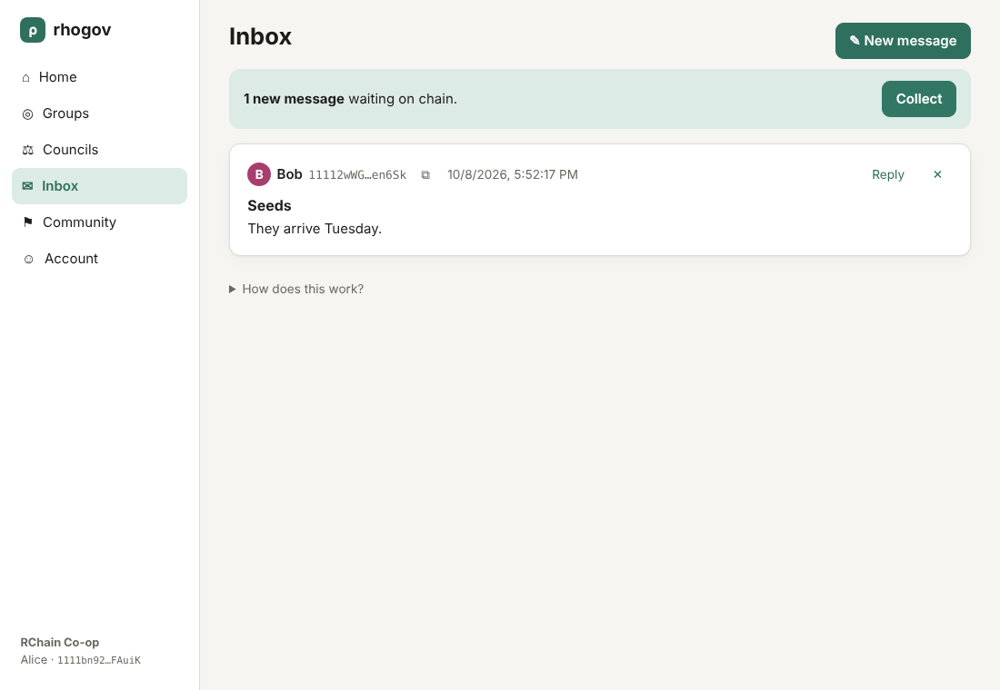

> Messages are **not encrypted**. Until you collect them they sit in the chain's
> data, where a determined person could read them. Don't send secrets.

## 9. Councils: decisions across stakeholder groups

Some decisions affect very different groups of people: users, developers,
validators, token holders. A **council** gives each of those groups its own voice
and lets everyone decide together how much weight each voice gets.

### Setting one up

Open **Councils** and press **＋ New council**. Give it a name and a short
statement of purpose (what it decides, and what it doesn't). Then pick its
**stakeholder groups**: Users, Developers, Validators, Token holders, Service
providers, Governance stewards, or your own. Invite-only groups are for
stakeholders whose standing should be checked, such as validators.

The person who creates a council is its **facilitator**. They start out as a
member of every stakeholder group, so they should **leave the ones they don't
belong to** (Stakeholder groups tab).

### Joining

On the **Stakeholder groups** tab, tick every group that describes you and press
**Join**. If you're both a developer and a token holder, join both; your ballot
then counts in each. Each stakeholder group is a normal group, with its own
members, trust, delegation and censure (**Members & trust →**).

### Voting power

How much should each stakeholder group's view count? Everyone decides. On the
**Voting power** tab, set the sliders to your estimate and submit. Each group's
power is the **middle value (median)** of everyone's estimates, so a few extreme
estimates can't swing it.

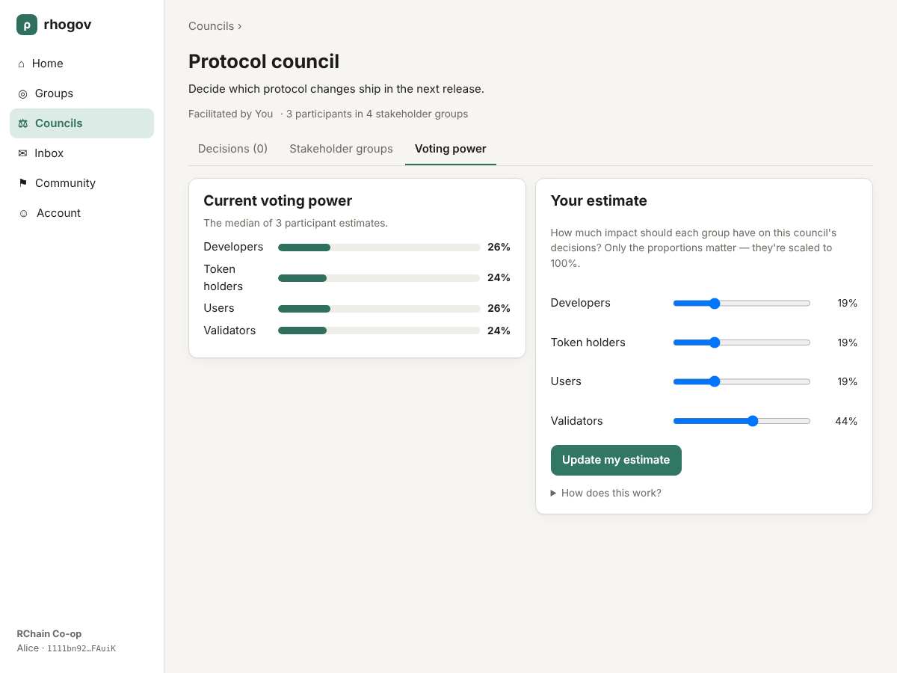

### A decision, step by step

The facilitator starts a decision with **＋ New decision**: the question, the
background (the problem and what success looks like), and the options. It then
moves through four phases:

1. **Prepare**: the facilitator frames the question and the options.
2. **Deliberate**: everyone adds the strongest **points for and against** each
   option and **👍 endorses** the points they find convincing, whichever way
   they'll vote.
3. **Decide**: the facilitator opens voting. Everyone ticks the options they
   can live with.
4. **Record & follow up**: the facilitator records the **decision of record**:
   the outcome, the reasoning, and the **action items** (who does what, by
   when). Points made against the chosen option are kept as **recorded dissent**.

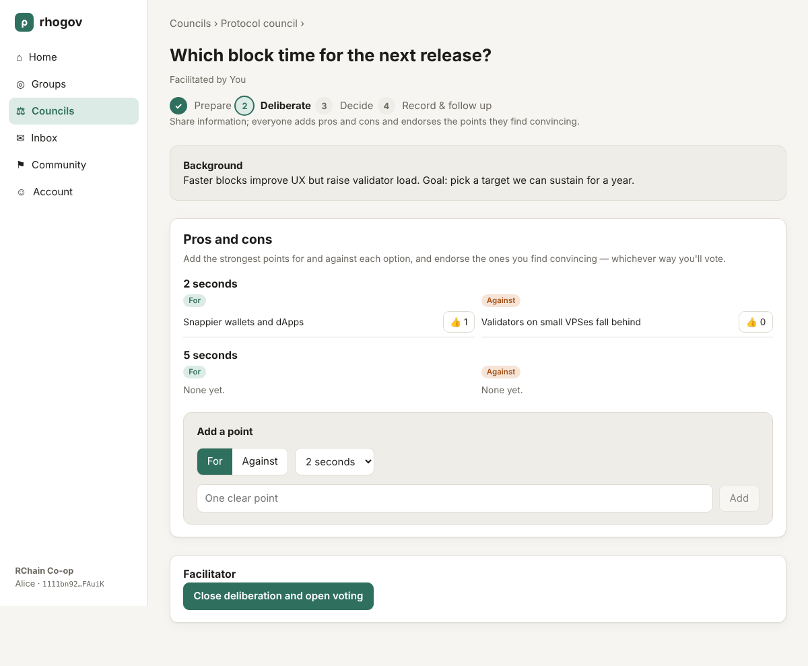

### How the result is worked out

Within each stakeholder group, the votes are weighed by *that group's own* trust
and delegation, and the node names the group's own choice. The overall score for
each option is:

> sum, over all groups, of (the group's voting power × the share of that group's
> weighted vote that approves the option)

A group that hasn't voted adds nothing, and its power isn't handed to the others.
So a missing voice shows up as missing support.

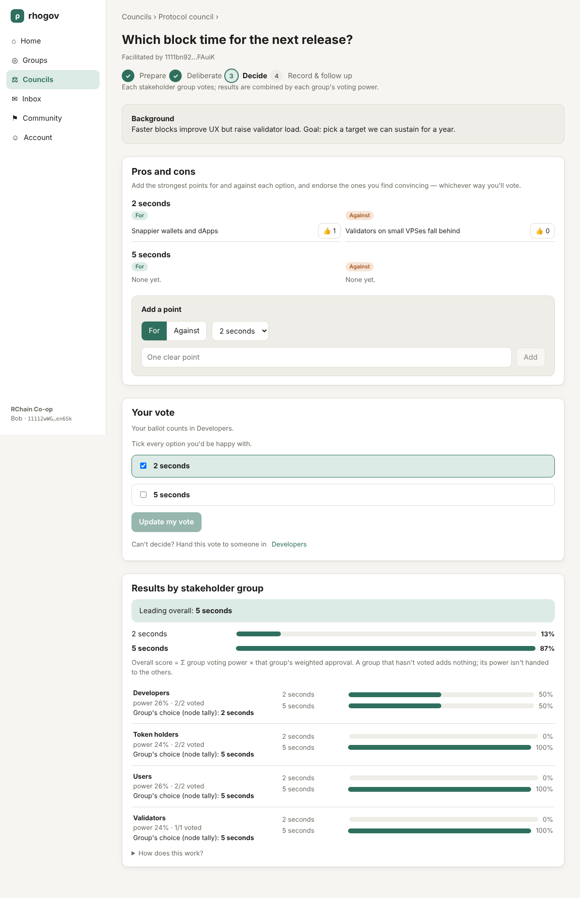

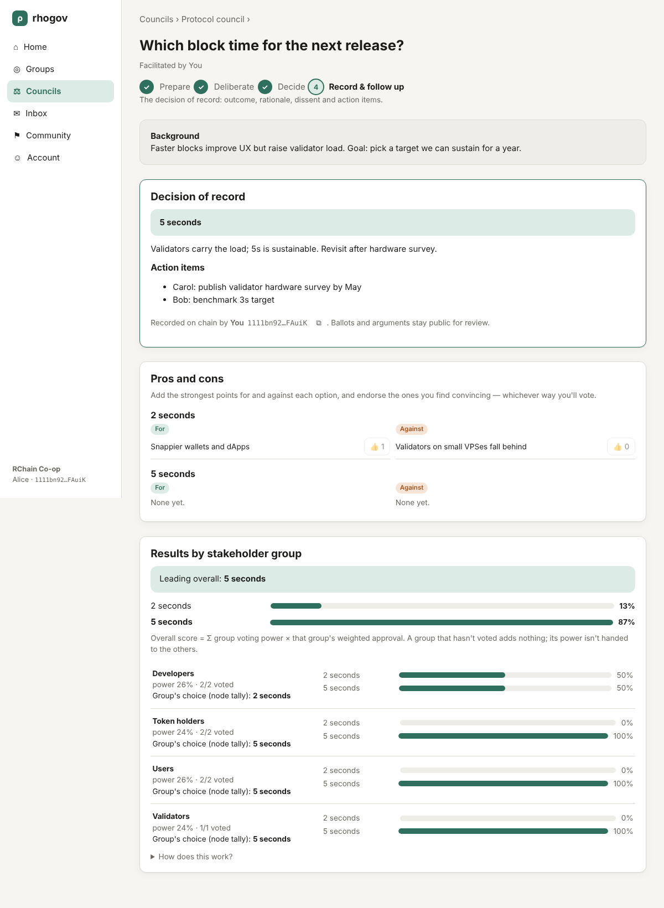

**New participants.** As with ordinary votes, people who join a council later
must be added to the open decisions. The facilitator sees an **Add them** button.

## 10. Your account and your key

On **Account** you can:

- change your display name. On networks that have the chain's name directory,
  only your key can set your name there, and everyone sees it;
- copy your **address**: give it to people who want to invite or message you;
- check your **balance** and, on the playground, **Get test REV**;
- **Download backup** of your key, or show it so you can paste it into another
  browser or device;
- turn on **Show me the exact rholang before I sign**, to see precisely what you're
  signing each time.

Your key **is** you. Anyone who has it can act as you, so keep backups private
and offline. If it's lost, that identity can't be recovered.

## 11. What is public, and what it costs

**Public, by design, and visible to anyone:**

- who belongs to which group, and their trust levels;
- who rated, delegated to and censured whom;
- every ballot (that's what makes the count verifiable);
- pros, cons, endorsements and decisions of record;
- how many inbox messages someone has (not their contents, but see the note in
  [section 8](#8-inbox)).

**Costs.** Every action is a small transaction paid in REV ("phlo" is the unit
of work). Typical actions cost a tiny fraction of the test REV the playground's
faucet gives you. Reading, browsing and seeing results are free.

**No server.** rhogov is a single web page. It talks only to the network node you
chose; there's no rhogov server, database or account.

## 12. Troubleshooting

| What you see | What to do |
|---|---|
| **"Can't reach it"** when choosing a network | Check the address. A local node needs `--api-host`. A page opened over `https://` can only reach `http://` nodes on your own computer. |
| **"Waiting for a block…"** for a long time | The network is busy or idle. It usually finishes within a minute; if not, refresh later, since your action may still land. |
| **A balance of 0**, or an action fails for lack of funds | On the playground, press **Get test REV** on Account. Elsewhere, ask someone to send you REV. |
| **"This group is invite-only…"** | Ask one of its admins to invite you, using your address from Account. |
| **"You're not on this issue's voter roll"** | You joined after the vote opened. Ask whoever opened it to add new members to the roll. |
| **People show as an address, not a name** | That network has no name directory (the playground, today); names come from what people typed when joining a group. |
| **Something looks out of date** | rhogov re-reads every 15 seconds; your own actions show up straight away. Reloading the page also works. |

## 13. Glossary

- **Address**: your public identifier on the network (starts with `1111`), safe to
  share.
- **Key**: the secret that signs your actions. Never share it.
- **REV / phlo**: the network's currency, and the unit that measures how much
  work an action takes.
- **Community**: everyone using one set of governance contracts.
- **Group**: people who vote together.
- **Delegate**: the person who carries your vote when you don't vote.
- **Trust level**: 0–5; a vote counts for 1 + the voter's level.
- **Censure**: a vote of no confidence in someone's trust.
- **Council**: a body that decides across several stakeholder groups.
- **Stakeholder group**: one kind of participant in a council, with its own
  members, trust and delegation.
- **Voting power**: how much a stakeholder group's view counts, set by the median
  of everyone's estimates.
- **Facilitator**: whoever runs a council's decisions through their phases.
- **Decision of record**: the outcome, rationale, action items and dissent, saved
  on chain.
